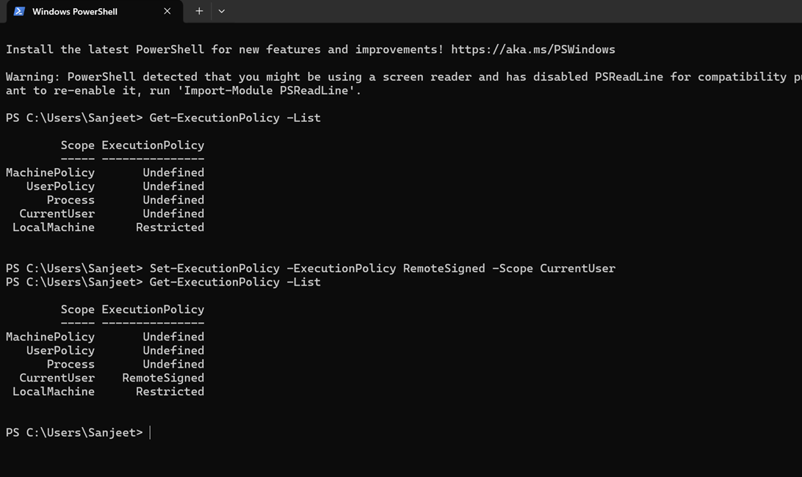

Allow PowerShell scripts for your user in vscode terminal

Open PowerShell as Administrator and run:
```
Set-ExecutionPolicy -ExecutionPolicy RemoteSigned -Scope CurrentUser
```
Press:

Y

Verify:
```
Get-ExecutionPolicy -List
```
You should see something like:
```
CurrentUser    RemoteSigned
```
Then restart VS Code.


Method 1 (Easiest)
* Press Windows key
* Type:
* PowerShell
* You'll see Windows PowerShell
* Right-click it
* Select Run as administrator
