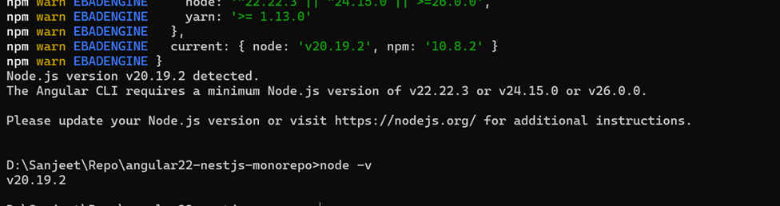
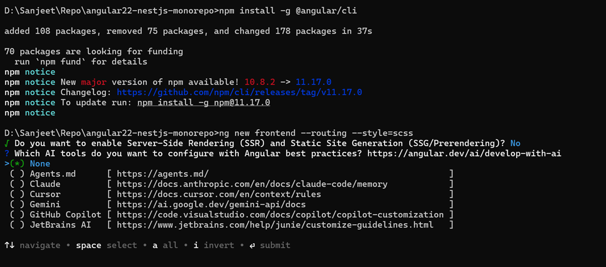
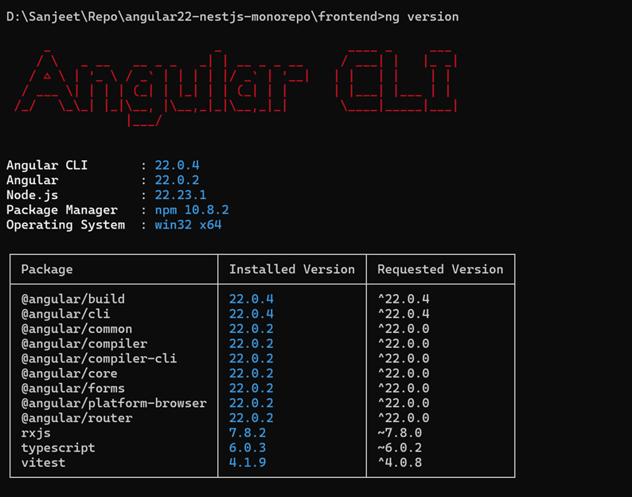
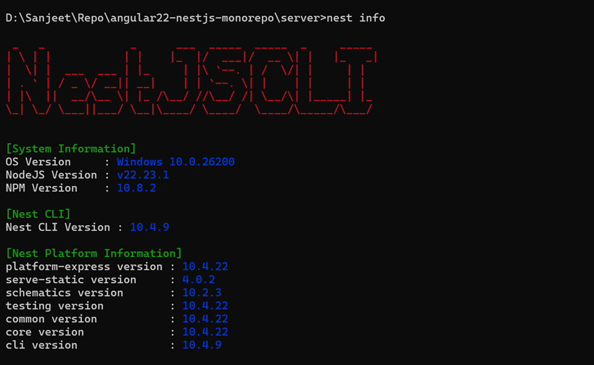

## angular MCP server
angular 22 on node 22+, Angular 22 was officially released on June 3, 2026
```
https://blog.angular.dev/announcing-angular-v22-c52bb83a4664
```



## on render
```
monorepo-app/
│
├── frontend/        (Angular 22)
│   ├── src
│   ├── angular.json
│   └── package.json
│
├── server/          (NestJS)
│   ├── src
│   ├── nest-cli.json
│   └── package.json
│
├── package.json     (root workspace)
└── render.yaml      (optional)
```

## deployment flow
```
Angular build
    ↓
frontend/dist/browser
    ↓
copy to
server/public
    ↓
NestJS serves static files
    ↓
Render Web Service
```
## Create Angular first
```
npx @angular/cli@22 new frontend
```
needs node v22 +

Verify:
```
ng version
```



## Create NestJS
```
nest new server
```
## Serve Angular from NestJS
```
npm install @nestjs/serve-static@4.0.2
```
run to Verify
```
nest info

npm list @nestjs/core

npm list @nestjs/common
```



another structure
```
sanjeet-portfolio/
├── frontend/     Angular 22
├── server/       NestJS 11
├── shared/       DTOs/types
└── render.yaml
```
Features:

* Angular 22 standalone components
* NestJS REST APIs
* PostgreSQL on Render (optional)
* JWT authentication
* Contact form API
* Docker-ready later if needed

This can be deployed on Render's free/low-cost plan as a single Web Service without any issues.