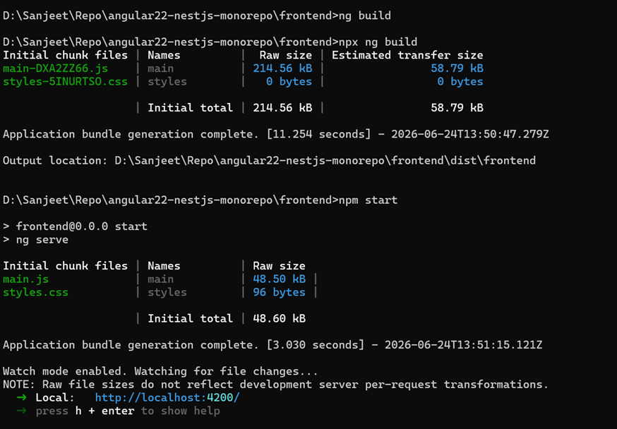

## Option 1 (Recommended and used): NestJS serves Angular

Build Angular and copy the generated files into NestJS.
```
frontend (Angular)
      ↓ build
dist/frontend/browser
      ↓
server/public
      ↓
NestJS serves static files
      ↓
Render Web Service
```


```
// app.module.ts

import { ServeStaticModule } from '@nestjs/serve-static';
import { join } from 'path';

@Module({
  imports: [
    ServeStaticModule.forRoot({
      rootPath: join(__dirname, '..', 'public'),
    }),
  ],
})
export class AppModule {}
```
Render then runs only one service:
```
npm run build
npm run start:prod
```
Advantages:
```
Single Render service
One domain
No CORS issues
Cheapest option
```

Render Build Command

For Option 1:
```
npm install
npm run build
```
start Command
```
npm run start:prod --workspace server
```
Keep API routes separate

Use:
```
@Controller('api/users')
```

```
/api/users
/api/auth
/api/contact
```

Then Angular routes can be:
```
/
/projects
/about
/contact
```

to start angular
```
npm start
```
or 
```
ng serve
```
http://localhost:4200

to run nest
```
npm run start:dev
```
http://localhost:3000


it prints Hello World! from appService  , which is called in nestjs app controller file
```
npm install -D concurrently
```

Start Angular only:
```
npm run start:frontend
```
Start NestJS only:
```
npm run start:server
```
Start both:
```
npm start
```
You should see something like:
```
[0] Angular Live Development Server is listening on localhost:4200
[1] Nest application successfully started
```
## Option 2: Separate Angular and NestJS services

```
Render Static Site
   └── Angular

Render Web Service
   └── NestJS API
```

Example:
```
frontend.mysite.com
api.mysite.com
```
Advantages:
```
Independent deployments
Easier scaling
```
Disadvantages:
```
CORS configuration
Two Render services
```

Root package.json workspace
```
{
  "private": true,
  "workspaces": [
    "frontend",
    "server"
  ]
}
```
Build script:
```
{
  "scripts": {
    "build": "npm run build --workspace frontend && npm run build --workspace server"
  }
}
```
