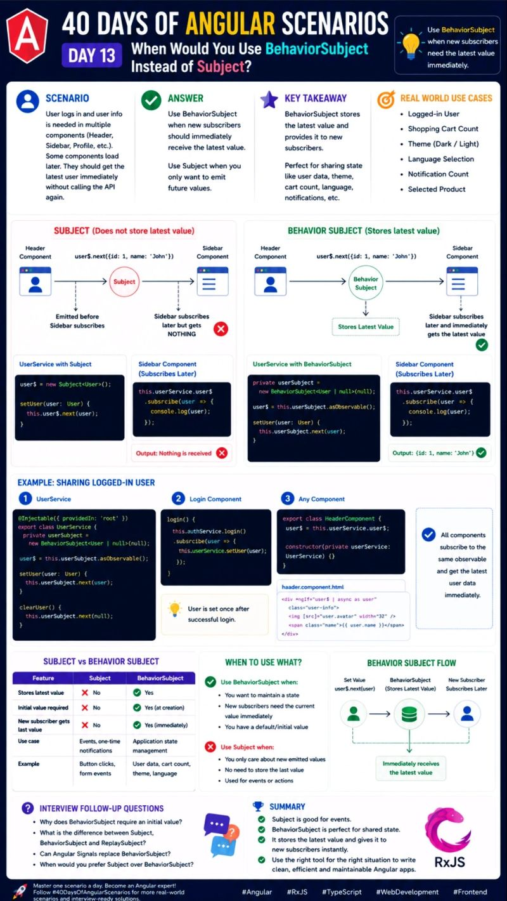

🚨 Why does one component get the latest data while another gets nothing?

This is one of the most common Angular + RxJS interview questions and often confuses developers.

🎯 Interview Scenario:
When would you use BehaviorSubject instead of Subject?
Imagine a user logs in, and the Header, Sidebar, and Profile components all need the logged-in user's information.

If a component subscribes after the value has already been emitted:
❌ Subject → Receives nothing.
✅ BehaviorSubject → Instantly receives the latest value.

💡 Key Takeaway: Use BehaviorSubject when new subscribers need the current/latest value immediately. Use Subject for one-time events like button clicks or notifications where previous values don't matter.

🔥 In today's post, I'll explain the difference between Subject and BehaviorSubject with real-world examples, practical code, and interview tips.

