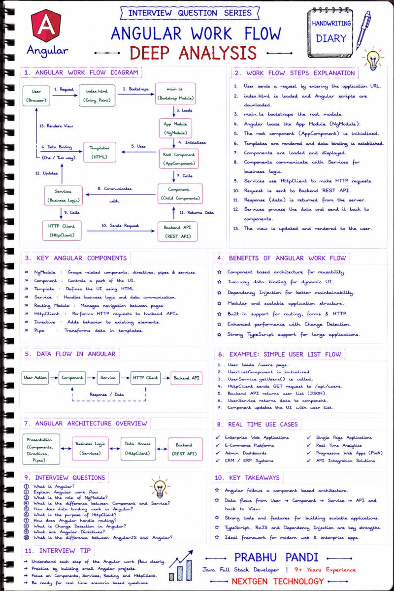

##🚀 ANGULAR WORKFLOW – INTERVIEW QUESTION SERIES 🚀

Understanding the Angular Workflow is essential for building scalable Single Page Applications (SPAs) and succeeding in Angular interviews.

##📌 Key Concepts Covered:

✅ Application Bootstrap

✅ Component Architecture

✅ Data Binding

✅ Dependency Injection

✅ Services & HttpClient

✅ Routing

✅ REST API Integration

✅ Change Detection

💡 Interview Tip:

##Frequently Asked Questions:

🔹 Explain the complete Angular workflow.

🔹 What is the role of main.ts?

🔹 What is AppModule?

🔹 How do Components and Services communicate?

🔹 How does HttpClient call REST APIs?

🔹 What is Dependency Injection?

🔹 How does Angular Routing work?

🔹 What is Change Detection?

🎯 Key Takeaway:

✔ Angular starts by bootstrapping the application through main.ts.

✔ Components manage the UI and interact with Services.

✔ Services use HttpClient to communicate with backend APIs.

✔ Data flows seamlessly between the UI and backend using Angular's powerful architecture.

🔥 Developer Insight:

Angular is widely used for Enterprise Web Applications, Single Page Applications (SPAs), CRM/ERP Systems, Admin Dashboards, E-Commerce Platforms, and Microservices-based Frontend Applications. A solid understanding of the Angular workflow is essential for senior Angular and Java Full Stack Developer interviews.

