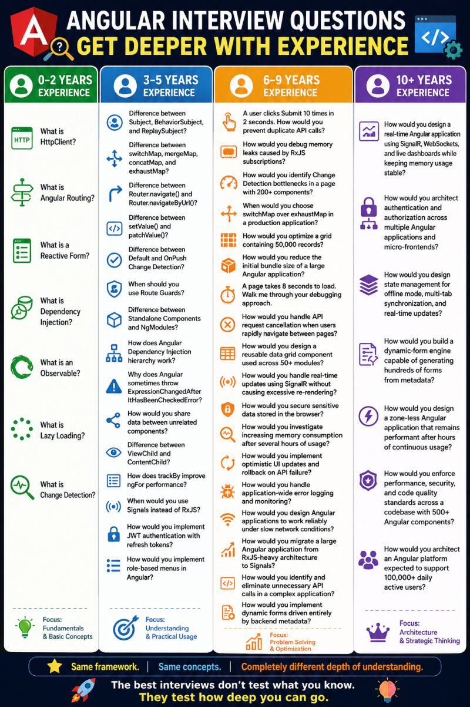

##🚀 Angular Interview Questions Get Deeper With Experience

##🟢 0–2 Years Experience

📌 What is HttpClient?

📌 What is Angular Routing?

📌 What is a Reactive Form?

📌 What is Dependency Injection?

📌 What is an Observable?

📌 What is Lazy Loading?

📌 What is Change Detection?

##🔵 3–5 Years Experience

📌 Difference between Subject, BehaviorSubject, and ReplaySubject?

📌 Difference between switchMap, mergeMap, concatMap, and exhaustMap?

📌 Difference between Router.navigate() and Router.navigateByUrl()?

📌 Difference between setValue() and patchValue()?

📌 Difference between Default and OnPush Change Detection?

📌 When should you use Route Guards?

📌 Difference between Standalone Components and NgModules?

📌 How does Angular Dependency Injection hierarchy work?

📌 Why does Angular sometimes throw ExpressionChangedAfterItHasBeenCheckedError?

📌 How would you share data between unrelated components?

📌 Difference between ViewChild and ContentChild

📌 How does trackBy improve ngFor performance?

📌 When would you use Signals instead of RxJS?

📌 How would you implement JWT authentication with refresh tokens?

📌 How would you implement role-based menus in Angular?

---

##🟠 6–9 Years Experience

📌 A user clicks Submit 10 times in 2 seconds. How would you prevent duplicate API calls?

📌 How would you debug memory leaks caused by RxJS subscriptions?

📌 How would you identify Change Detection bottlenecks in a page with 200+ components?

📌 When would you choose switchMap over exhaustMap in a production application?

📌 How would you optimize a grid containing 50,000 records?

📌 How would you reduce the initial bundle size of a large Angular application?

📌 A page takes 8 seconds to load. Walk me through your debugging approach.

📌 How would you handle API request cancellation when users rapidly navigate between pages?

📌 How would you design a reusable data grid component used across 50+ modules?

📌 How would you handle real-time updates using SignalR without causing excessive re-rendering?

📌 How would you secure sensitive data stored in the browser?

📌 How would you investigate increasing memory consumption after several hours of usage?

📌 How would you implement optimistic UI updates and rollback on API failure?

📌 How would you handle application-wide error logging and monitoring?

📌 How would you design Angular applications to work reliably under slow network conditions?

📌 How would you migrate a large Angular application from RxJS-heavy architecture to Signals?

📌 How would you identify and eliminate unnecessary API calls in a complex application?

📌 How would you implement dynamic forms driven entirely by backend metadata?

https://www.linkedin.com/posts/sushil-suryawanshi-b26228247_angular-angulardeveloper-rxjs-share-7471851410628734976-kXDU/?utm_source=share&utm_medium=member_android&rcm=ACoAAFmMxUQBUvaK3SPYJM-FwQuV_PBE-bd4ppM

