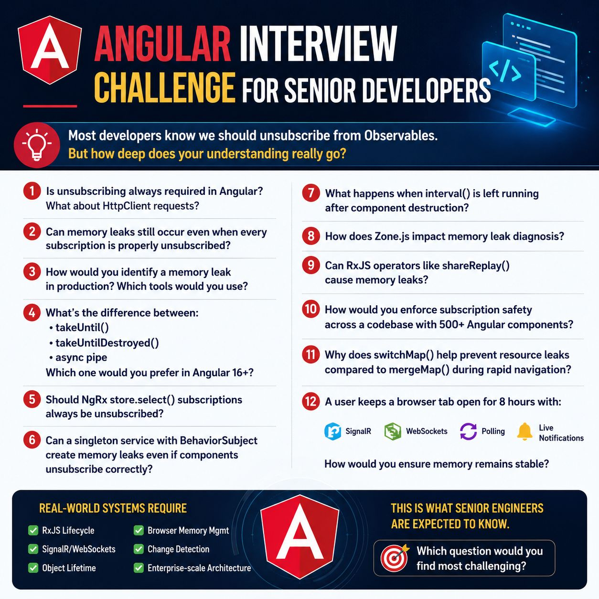

Most developers know we should unsubscribe from Observables.

But how deep does your understanding really go?

Here are some questions I ask when evaluating Angular engineers beyond the basics:

1️⃣ Is unsubscribing always required in Angular?
What about HttpClient requests?

2️⃣ Can memory leaks still occur even when every subscription is properly unsubscribed?

3️⃣ How would you identify a memory leak in production?
Which tools would you use?

4️⃣ What's the difference between:
• takeUntil()
• takeUntilDestroyed()
• async pipe

Which one would you prefer in Angular 16+?

5️⃣ Should NgRx store.select() subscriptions always be unsubscribed?

6️⃣ Can a singleton service with BehaviorSubject create memory leaks even if components unsubscribe correctly?

7️⃣ What happens when interval() is left running after component destruction?

8️⃣ How does Zone.js impact memory leak diagnosis?

9️⃣ Can RxJS operators like shareReplay() cause memory leaks?

🔟 How would you enforce subscription safety across a codebase with 500+ Angular components?

1️⃣1️⃣ Why does switchMap() help prevent resource leaks compared to mergeMap() during rapid navigation?

1️⃣2️⃣ A user keeps a browser tab open for 8 hours with:
• SignalR
• WebSockets
• Polling
• Live notifications

How would you ensure memory remains stable?

Most Angular interviews stop at:
"Why should we unsubscribe?"

Real-world systems require understanding:
✅ RxJS lifecycle
✅ Browser memory management
✅ SignalR/WebSockets
✅ Change Detection
✅ Object lifetime
✅ Enterprise-scale architecture

