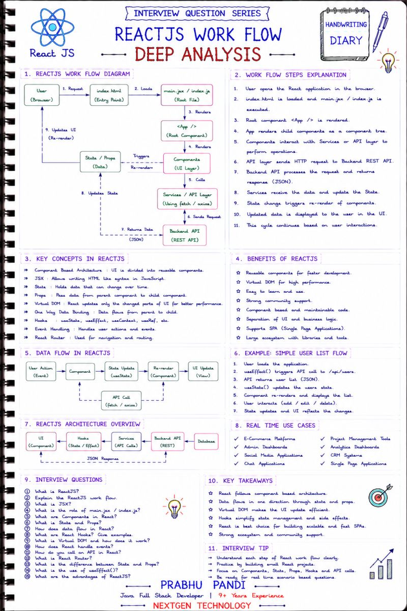

## REACTJS WORKFLOW – INTERVIEW QUESTION SERIES 🚀

Understanding the ReactJS Workflow is essential for building modern, high-performance web applications. It is one of the most frequently asked topics in ReactJS interviews.

##📌 Key Concepts Covered:

✅ React Application Lifecycle

✅ Component-Based Architecture

✅ JSX & Virtual DOM

✅ State & Props

✅ Hooks (useState, useEffect)

✅ API Integration (fetch / axios)

✅ One-Way Data Binding

✅ Component Re-rendering

💡 Interview Tip:

##Frequently Asked Questions:

🔹 Explain the complete ReactJS workflow.

🔹 What is Virtual DOM?

🔹 What is the difference between State and Props?

🔹 How do React Hooks work?

🔹 What is JSX?

🔹 How does React communicate with REST APIs?

🔹 Why does a component re-render?

🔹 What are the advantages of ReactJS?

🎯 Key Takeaway:

✔ React follows a component-based architecture.

✔ Data flows from Parent → Child using Props.

✔ State updates trigger efficient UI re-rendering through the Virtual DOM.

✔ Hooks simplify state management and side effects.

✔ React enables fast, reusable, and scalable frontend development.

🔥 Developer Insight:

ReactJS is widely used in Single Page Applications (SPAs), Enterprise Applications, E-Commerce Platforms, Admin Dashboards, Social Media Applications, CRM Systems, and Microservices-based Frontend Applications. Mastering the ReactJS workflow is essential for senior Frontend and Java Full Stack Developer interviews.

