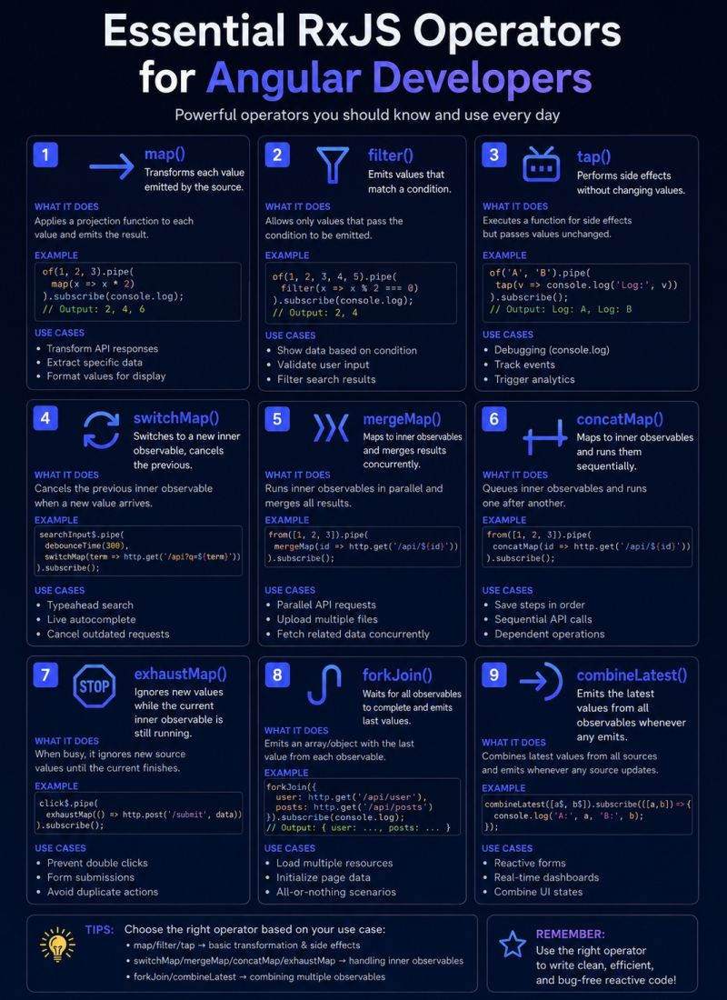

##Essential RxJS Operators for Angular Developers

Reactive programming is at the heart of Angular applications, and mastering RxJS operators can significantly improve code quality, performance, and maintainability.

1. map()
Purpose: Transform emitted values into a new format.

2. filter()
Purpose: Emit only values that satisfy a condition.

3. tap()
Purpose: Perform side effects without modifying data.

4. switchMap()
Purpose: Cancel previous inner subscriptions and switch to the latest one.

5. mergeMap()
Purpose: Execute multiple inner observables concurrently.

6. concatMap()
Purpose: Process observables sequentially.

7. exhaustMap()
Purpose: Ignore new emissions while the current observable is active.

8. forkJoin()
Purpose: Wait for all observables to complete and emit their final values.

9. combineLatest()
Purpose: Combine the latest values from multiple observables.

