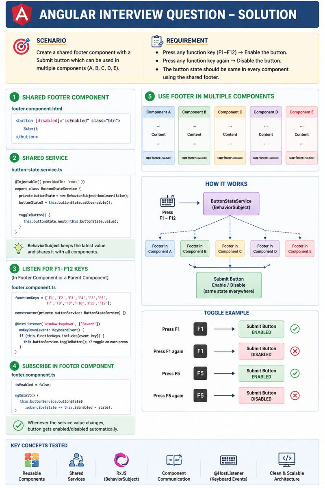

 Angular Interview Question

👉 "You have 5 pages. Each page has the same footer with a Submit button.
The button should toggle ON/OFF when you press any F-key (F1–F12).
How do you build this?"

Here's the clean solution:

━━━━━━━━━━━━━━━━━━━
🧩 STEP 1 — Create ONE shared footer
━━━━━━━━━━━━━━━━━━━

Instead of copying the footer 5 times — build it once:

ng generate component shared/footer

Then just drop it in every page:
<app-footer></app-footer>

Done. One component. Zero duplication.

━━━━━━━━━━━━━━━━━━━
⚡ STEP 2 — Store the button state in a Service
━━━━━━━━━━━━━━━━━━━

Create a shared service using BehaviorSubject:

private buttonState = new BehaviorSubject<boolean>(false);
buttonState$ = this.buttonState.asObservable();

toggleButton() {
this.buttonState.next(!this.buttonState.value);
}

Why BehaviorSubject?
✅ Every subscriber gets the latest value immediately
✅ No need to manually sync state between components
✅ Single source of truth

━━━━━━━━━━━━━━━━━━━
⌨️ STEP 3 — Listen to F1–F12 keys
━━━━━━━━━━━━━━━━━━━

@HostListener('window:keydown', ['$event'])
handleKey(event: KeyboardEvent) {
  if (event.key.startsWith('F')) {
    this.buttonService.toggleButton();
  }
}

Every F-key press → toggles the button state globally.

━━━━━━━━━━━━━━━━━━━
🔄 STEP 4 — Footer subscribes and updates
━━━━━━━━━━━━━━━━━━━

ngOnInit() {
  this.buttonService.buttonState$
    .subscribe(state => this.isEnabled = state);
}

The flow is simple:

F1 pressed
  → Service toggles state
    → BehaviorSubject emits
      → All footers update instantly ✅

━━━━━━━━━━━━━━━━━━━
🏗️ THE ARCHITECTURE
━━━━━━━━━━━━━━━━━━━

Keyboard (F1–F12)
       ↓
Shared Button Service
  (BehaviorSubject)
       ↓
┌──────┬──────┬──────┐
Footer Footer Footer ...
  ↓      ↓      ↓
Button Button Button

One service. One component. Five pages. Zero duplication.

━━━━━━━━━━━━━━━━━━━
💡 Key Concepts Used:
✅ Shared component — reusability
✅ BehaviorSubject — reactive state
✅ @HostListener — global event listening
✅ Dependency Injection — single service, many consumers

