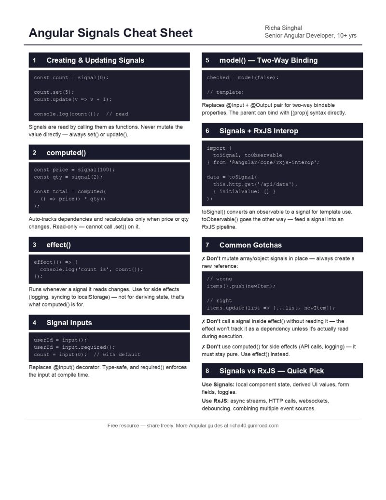

Covers:
→ signal(), computed(), effect() - the core three
→ Signal Inputs - the type-safe replacement for @Input()
→ model() - two-way binding without the @Input/@Output pair
→ Signals + RxJS interop - toSignal() and toObservable()
→ The mutation gotcha that silently breaks OnPush components
→ Signals vs RxJS - when to actually use which

##  Gumroad 
