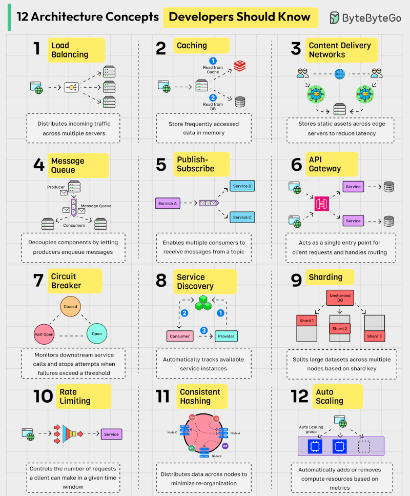

🚀 𝟭𝟮 𝗔𝗿𝗰𝗵𝗶𝘁𝗲𝗰𝘁𝘂𝗿𝗮𝗹 𝗖𝗼𝗻𝗰𝗲𝗽𝘁𝘀 𝗘𝘃𝗲𝗿𝘆 𝗗𝗲𝘃𝗲𝗹𝗼𝗽𝗲𝗿 𝗦𝗵𝗼𝘂𝗹𝗱 𝗞𝗻𝗼𝘄 2026!
As systems grow in scale and complexity, strong fundamentals in system design become a key differentiator for developers. 

Whether you're building high-traffic applications or preparing for technical interviews, these core architectural concepts form the backbone of scalable systems:
𝟭. 𝗟𝗼𝗮𝗱 𝗕𝗮𝗹𝗮𝗻𝗰𝗶𝗻𝗴 – Distribute incoming traffic across multiple servers to prevent overload and ensure high availability.
𝟮. 𝗖𝗮𝗰𝗵𝗶𝗻𝗴 – Store frequently accessed data in memory to dramatically reduce latency and improve performance.
 𝟯. 𝗖𝗼𝗻𝘁𝗲𝗻𝘁 𝗗𝗲𝗹𝗶𝘃𝗲𝗿𝘆 𝗡𝗲𝘁𝘄𝗼𝗿𝗸 (𝗖𝗗𝗡) – Deliver static content from geographically distributed edge servers for faster user experiences.
 𝟰. 𝗠𝗲𝘀𝘀𝗮𝗴𝗲 𝗤𝘂𝗲𝘂𝗲 – Enable asynchronous communication by decoupling producers and consumers.
 𝟱. 𝗣𝘂𝗯𝗹𝗶𝘀𝗵-𝗦𝘂𝗯𝘀𝗰𝗿𝗶𝗯𝗲 – Allow multiple consumers to react to events through topic-based messaging.
𝟲. 𝗔𝗣𝗜 𝗚𝗮𝘁𝗲𝘄𝗮𝘆 – Provide a unified entry point with routing, authentication, rate limiting, and protocol translation.
𝟳. 𝗖𝗶𝗿𝗰𝘂𝗶𝘁 𝗕𝗿𝗲𝗮𝗸𝗲𝗿 – Protect your system by stopping repeated calls to failing services.
𝟴. 𝗦𝗲𝗿𝘃𝗶𝗰𝗲 𝗗𝗶𝘀𝗰𝗼𝘃𝗲𝗿𝘆 – Dynamically locate service instances in distributed environments.
𝟵. 𝗦𝗵𝗮𝗿𝗱𝗶𝗻𝗴 – Partition large datasets across nodes to improve scalability and performance.
𝟭𝟬. 𝗥𝗮𝘁𝗲 𝗟𝗶𝗺𝗶𝘁𝗶𝗻𝗴 – Safeguard services by controlling request rates.
 𝟭𝟭. 𝗖𝗼𝗻𝘀𝗶𝘀𝘁𝗲𝗻𝘁 𝗛𝗮𝘀𝗵𝗶𝗻𝗴 – Efficiently distribute data across nodes with minimal reshuffling.
 𝟭𝟮. 𝗔𝘂𝘁𝗼 𝗦𝗰𝗮𝗹𝗶𝗻𝗴 – Automatically adjust infrastructure based on traffic and usage patterns
 
 