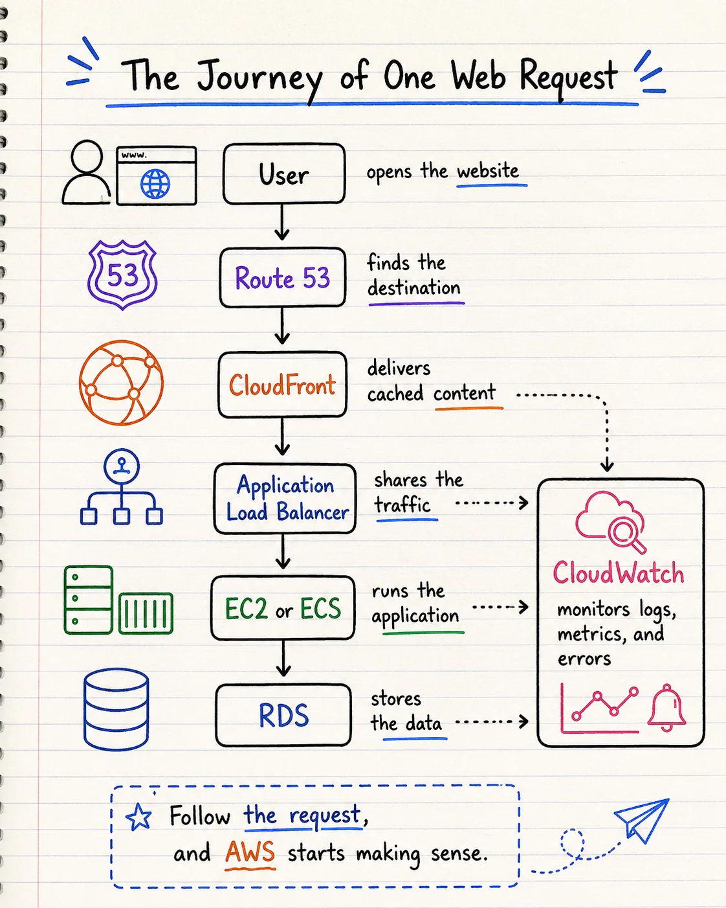
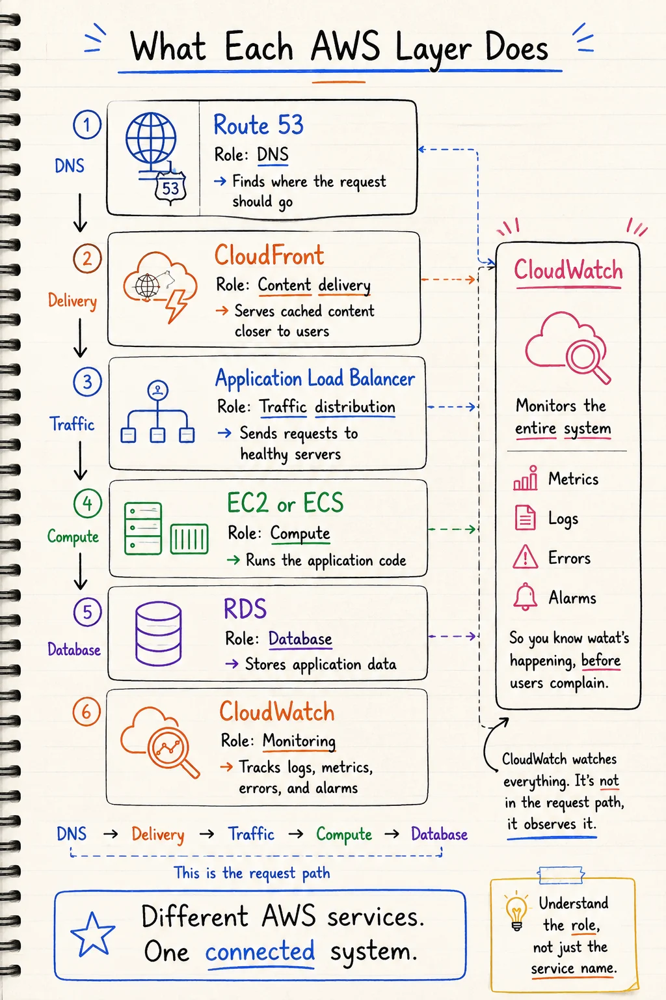

## The AWS flow behind “opening a website” ☁️

You type a website address.

You press Enter.

A second later, the page appears.

Simple, right?

But behind that one click, several AWS services may already be working together.

Most learners know services like:

→ Route 53
→ CloudFront
→ Load Balancer
→ EC2
→ RDS
→ CloudWatch

But they learn them separately.

That is why AWS can feel like a collection of random tools.

Today, let’s connect them.

## ☁️ The journey of one request
Here is one common AWS web application flow:

User
↓
Route 53
↓
CloudFront
↓
Application Load Balancer
↓
EC2 or ECS
↓
RDS

Alongside this flow:

CloudWatch monitors the system.

Now let’s understand what each service does.

## 1. Route 53 finds the destination
The user enters a domain like:

example.com

But the request still needs to know where to go.

Route 53 connects the domain name to the correct AWS destination.

Think of it as the address book of your application.

It answers:

“Where should this request go?”

## 2. CloudFront delivers content faster
CloudFront stores copies of content closer to users.

It is commonly used for:

→ images
→ videos
→ CSS files
→ JavaScript files
→ downloads

Instead of sending every request back to the main server, CloudFront can serve cached content from a nearby location.

The result:

→ faster loading
→ less pressure on your servers
→ better performance for global users

## 3. The Load Balancer shares traffic
The Application Load Balancer acts like a traffic controller.

If your application runs across multiple servers, it decides where each request should go.

For example:

Request 1 → Server A
Request 2 → Server B
Request 3 → Server C

It also checks whether each server is healthy.

If one server stops responding, the Load Balancer can stop sending traffic to it.

## 4. EC2 or ECS runs the application
This is where the main application logic runs.

The application may need to:

→ check login details
→ display products
→ calculate totals
→ process an order
→ communicate with another service

EC2 gives you virtual servers.

ECS helps you run containerized applications.

Different services.

Same role:

Run the application code.

## 5. RDS stores the data
The application may need to store or retrieve:
→ user accounts
→ products
→ orders
→ transactions
→ account settings

That data can live inside an RDS database.

When a user opens a product page, the application may ask:

“What information should I display?”

When they place an order, it may ask:

“Can you save this transaction?”

## 6. CloudWatch monitors the system
CloudWatch does not sit directly inside the request path.

Instead, it watches the services around it.

It can collect:

→ logs
→ metrics
→ errors
→ alarms

For example:

→ Is CPU usage too high?
→ Are requests failing?
→ Is the application becoming slow?
→ Did a server stop responding?

Without monitoring, you may not know something is broken until users start complaining.

And that is not the alert system we want 😅

## 🧠 The whole flow in plain English
Route 53 finds the destination.

CloudFront delivers content faster.

The Load Balancer shares the traffic.

EC2 or ECS runs the application.

RDS stores the data.

CloudWatch monitors the system.

That is the big picture.

You do not need to memorize every AWS service first.

You need to understand how the request moves through the architecture.

## 🛠️ Your two-minute task
Pick one application you use regularly.

It could be:

→ Netflix
→ Amazon
→ Spotify
→ Instagram
→ an online banking app

Now complete these four lines:

User enters through:
Application code runs on:
Data could be stored in:
Monitoring could happen through:

You do not need the perfect answer.

The goal is to practice connecting the layers.